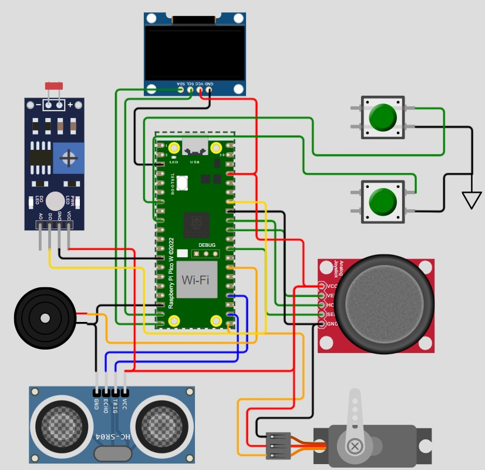

# 📌 Dispenser Automatizado para Portadores de Alzheimer

  

<strong>Figura 1 - Desenho do Hardware</strong>

## ✍️ Autor 
|                                              Foto                                               |       Nome       |                          Github                           |
| :---------------------------------------------------------------------------------------------: | :--------------: | :-------------------------------------------------------: |
|                 |   Tífany de Paula Severo    |           [Tifany-Devil](https://github.com/Tifany-Devil)           |

## 📖 Sobre o Projeto
Este repositório contém o código-fonte e a documentação do projeto final da seleção para o programa de residência da **[EmbarcaTech](https://embarcatech.softex.br/)**. O projeto consiste em um **dispenser automatizado de medicamentos** voltado para **pessoas portadoras de Alzheimer**.

O objetivo principal do sistema é **controlar a administração dos medicamentos**, garantindo que sejam dispensados nos horários corretos, emitindo alertas e verificando se o usuário tomou a medicação.

## 🎯 Funcionalidades
✔️ Dispensação automática dos medicamentos conforme a prescrição médica e previamente programados
✔️ Alertas sonoros e visuais para lembrar o usuário de tomar o medicamento  
✔️ Monitoramento do consumo e verificação de ingestão  

## 🏗️ Tecnologias Utilizadas
- ⚡ **Hardware:** (a definir conforme protótipo)  
- ☁️ **Software:** (a definir conforme protótipo)  

## 📌 Futuros Passos
- Finalização do protótipo físico do dispenser  
- Testes de funcionamento e ajustes no software  
- Validação com especialistas da área de saúde  
